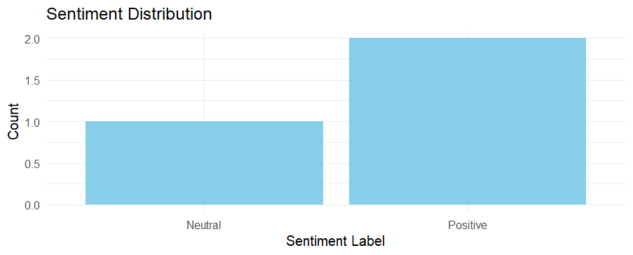
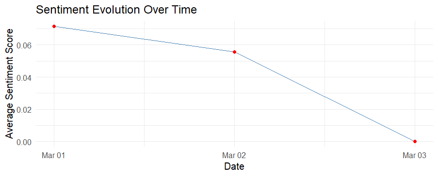
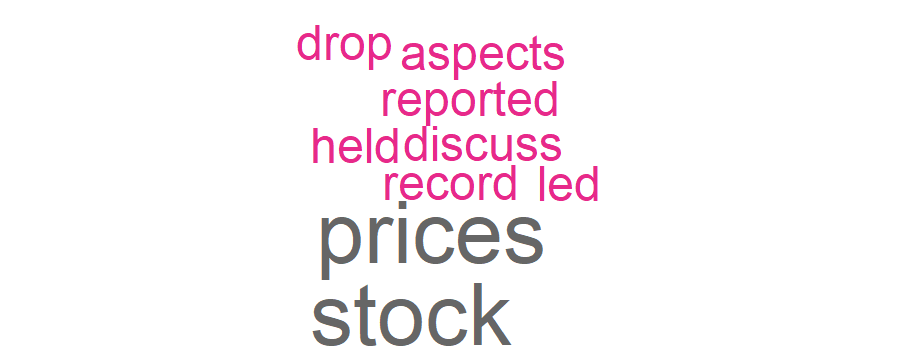

```{r setup, include = FALSE}
knitr::opts_chunk$set(
  collapse = TRUE,
  comment = "#>",
  eval = FALSE,
  warning = FALSE, 
  message = FALSE
)
```

## Introduction

In today's fast-paced world, staying informed about politics, economics, and technology is more challenging than ever. The **elmiguelon** package helps you track the latest news trends by gathering trending headlines and articles from multiple sources. With built-in sentiment analysis, keyword search capabilities, data visualization, and translation features, this package streamlines news consumption, allowing you to quickly focus on what matters most.

This vignette will guide you through the main features of the package and demonstrate how to use them effectively.

## Installation

You can install the development version of elmiguelon from GitHub:

```{r}
# install.packages("devtools")
devtools::install_github("ajayatil/elmiguelon")
```

After installation, load the package:

```{r}
library(elmiguelon)
```

## Setting Up API Keys

Before using the package, you need to set up your API keys for both the NewsAPI and OpenAI services:

> **Important Note:** When trying the examples in this vignette, make sure your API keys are properly set. The examples in this vignette are not executed during package building to avoid API authentication errors.

### Using `save_api_keys()`

The package provides a convenient function to save your API keys in your `.Renviron` file:

```{r}
# Set both API keys at once
save_api_keys(
  news_api_key = "your_news_api_key_here",
  openai_api_key = "your_openai_api_key_here"
)

# Or call without arguments to be prompted for each key
save_api_keys()
```

After setting up your API keys, you'll see the message `API keys have been saved.`.

## Basic News Retrieval

> **Important Note**: The number of retrieved articles and the available date ranges depend on your NewsAPI subscription plan. Free subscriptions may have limitations on the amount of data and the date ranges available.

### Getting News Articles with `get_news_everything()`

The `get_news_everything()` function allows you to search for news articles based on keywords, date ranges, and other criteria:

```{r}
# Retrieve articles about climate change
climate_news <- get_news_everything(keyword = "climate")

# Display the first few results
head(climate_news)
```

You can refine your search with additional parameters:

```{r}
# Search for articles from a specific date range
ai_news <- get_news_everything(
  keyword = "AI",
  from = "2025-03-12",
  to = "2015-03-16",
  sortBy = "publishedAt"
)

# Search in a different language
spanish_news <- get_news_everything(
  keyword = "elecciones",
  language = "es",
  sortBy = "popularity"
)
```

Note: The `get_news_everything()` function returns a data frame containing details of news articles such as the title, content, URL, source name, and publication date.

### Getting Top Headlines with `get_top_headlines()`

The `get_top_headlines()` function retrieves the most recent and important news articles across various categories:

```{r}
# Get top headlines from all categories
top_news <- get_top_headlines()

# Get top headlines from a specific category
tech_news <- get_top_headlines(category = "technology")
business_news <- get_top_headlines(category = "business")
```

Note: The `get_top_headlines()` function returns a data frame containing details of news articles such as the title, content, URL, and publication date.

## Advanced Features

### Article Translation with `search_and_translate_news()`

This function streamlines your workflow by combining news retrieval with an interactive translation process. When you call the function, it performs the following steps:

1.  **Article Retrieval**: It retrieves the top 20 news articles based on your specified criteria. The articles are then displayed in a numbered list.

2.  **Interactive Prompts**:

-   **Select an Article**: You’ll be asked to enter the number corresponding to the article you want to translate from the displayed list.
-   **Specify a Target Language**: After selecting the article, you will be prompted to enter your preferred language for the translation.

3.  **Translation Process**: The function sends the selected article's content to the OpenAI API using the `gpt-3.5-turbo` model. It then returns the translated title and summary, providing you with a concise overview in your chosen language.

Below are some example usages:

```{r translate, eval=FALSE}
# Search for articles about Apple and translate a selected article
search_and_translate_news(
  search_method = "everything",
  keyword = "Apple",
  from = "2025-03-01",
  to = "2025-03-08",
  sortBy = "relevancy"
)


# ==== Retrieved Articles ====
# [1] Apple reportedly challenges the UK’s secretive encryption crackdown
#     Source:The Verge
#     PublishedAt:2025-03-04T18:29:39Z
# 
# [2] Apple 11-inch and 13-inch iPad Air : Price, Specs, Availability
#     Source:Wired
#     PublishedAt:2025-03-04T15:46:35Z
# Enter the article number to translate: 2
# Enter the preferred language: Spanish
# 
# Translating the article using OpenAI...
# 
# ==== Translation Result ====
# Título: iPad Air de 11 y 13 pulgadas de Apple: Precio, Especificaciones, Disponibilidad
# 
# Resumen: Apple ha lanzado una nueva versión mejorada del iPad Air con el chip M3 y una actualización del modelo base del iPad con chip A16 y el doble de almacenamiento. Ambos modelos están disponibles para preorden y se enviarán a partir del 12 de marzo. El iPad Air presenta mejoras internas significativas, incluyendo un rendimiento de CPU hasta un 35% más rápido y gráficos hasta un 40% más rápidos que el modelo anterior. Además, Apple ha lanzado una nueva versión del teclado Magic Keyboard para el iPad Air, con mejoras similares al modelo para el iPad Pro. El precio de los modelos de 11 y 13 pulgadas del iPad Air comienza en $599 y $799 respectivamente, mientras que el iPad base (11ª generación) tiene un precio inicial de $349.
```

```{r translate-headlines, eval=FALSE}
# Get top business headlines and translate one
search_and_translate_news(
  search_method = "top-headlines",
  category = "business"
)

# ==== Retrieved Articles ====
# [1] COMP at a critical level – Will it see a steep drop to $23? - AMBCrypto News
#     Source:(No source)
#     PublishedAt:2025-03-17T00:04:10Z
# 
# [2] What will happen to payment stocks in a recession? Bernstein takes clues from 2008 (V:NYSE) - Seeking Alpha
#     Source:(No source)
#     PublishedAt:2025-03-16T21:40:00Z
# Enter the article number to translate: 1
# Enter the preferred language: Korean
# 
# Translating the article using OpenAI...
# 
# ==== Translation Result ====
# Title Translation: COMP가 위험 수준에 도달 - 23달러까지 급락할까?
# 
# Summary:
# COMP의 가격 하락이 예상되고 있습니다. 최근 1주일과 1개월 동안 COMP의 가격은 각각 12.31%와 24.92% 하락했습니다. 현재 COMP는 중요한 지지선에서 거래되고 있으며, 이 지지선이 무너지면 큰 하락이 예상됩니다. 현재 COMP는 2023년 7월 이후 계속되어온 보합 채널의 하한선에서 거래 중이며, 이 지지선을 넘어 COMP가 하락세의 마지막 단계로 진입할 수 있습니다. 현재 차트상 다음 지지선은 23.27달러이며, 이 지지선을 넘어 COMP는 20달러 미만까지 하락할 수 있습니다. 파생 상품 시장에서는 COMP가 이 핵심 지지선 아래로 떨어질 가능성이 높으며, 판매자 지표가 이를 시사하고 있습니다. 현재 판매 활동이 증가하고 있으며, 약 71,000달러의 COMP가 시장에 판매되었습니다. 이러한 판매가 계속되면, 파생 상품 시장의 악화된 심리와 함께 COMP는 예상대로 큰 가격 하락을 겪을 수 있습니다.
```

### Fake News Detection with `fake_news_detection()`

This function helps you analyze articles for clickbait headlines or similar article content across different sources:

```{r fake-news, eval=FALSE}
# Get news articles about Apple
apple_news <- get_news_everything(
  keyword = "Apple",
  from = "2025-03-01",
  to = "2025-03-11",
  sortBy = "popularity"
)

# Analyze the articles for fake news indicators
fake_news_results <- fake_news_detection(apple_news)
print(fake_news_results)
```

When running this function, users will be prompted to choose:

1.  The type of analysis (1. Clickbait Detection or 2. Similarity Analysis)
2.  The analysis method (1. OpenAI's language model or 2. R's NLP packages)

The function returns a data frame with results based on the selected analysis type:

Clickbait Detection: Returns a data frame with two columns:

`title`: The article title\
`clickbait`: "Yes" or "No" classification

Similarity Analysis: Returns a data frame with four columns:

`title`: The article title\
`full_content`: The full text of the article\
`similarity_score`: The similarity score comparing each article with the rest in the dataset\
`overall_similarity`: A single value representing the overall similarity among all articles

**\
Important Note:**

-   Full Article Retrieval: Since NewsAPI provides only limited article content, the function performs web scraping to retrieve the full text before analysis. Users will see the message: `Note: The function retrieves full article content via web scraping. Please wait for the analysis to complete!`

-   Performance Optimization: When using OpenAI's API for similarity analysis, the function limits analysis to the top 25 articles to ensure efficient processing.

### Select sentiment analysis method with `get_sentiment()`

This function selects the sentiment analysis method to use for a given text. For the OpenAI method, it always returns the detailed output (including the "details" field). You can choose between the OpenAI API and native R analysis (using the "bing" lexicon).

```{r get_sentiment, eval=FALSE}
# Using OpenAI detailed analysis
result_openai <- get_sentiment("The company's performance was outstanding!", method = "openai")
print(result_openai)
# Expected output (example):
# $score
# [1] 0.85
# $label
# [1] "Positive"
# $details
# [1] "The text conveys enthusiasm and confidence about the company's performance."

# Using native R method
result_r <- get_sentiment("The company's performance was outstanding!", method = "r")
print(result_r)
# Expected output (example):
# $score
# [1] 0.5
# $label
# [1] "Positive"
```

### Applies sentiment analysis with `analyze_sentiment()`

This function applies sentiment analysis to each row of a data frame containing text data (e.g., news articles). It adds two new columns: `sentiment_score` and `sentiment_label`. Below is an example using a dummy dataset:

```{r analyze_sentiment, eval=FALSE}
# Create a dummy data frame of articles
dummy_articles <- data.frame(
  title = c("Good News", "Bad News", "Neutral News"),
  content = c(
    "The company reported record profits this quarter, leading to a surge in stock prices.",
    "The recent scandal has severely damaged the company's reputation and led to a significant drop in stock prices.",
    "The meeting was held to discuss various aspects of the company's operations."
  ),
  publishedAt = c("2025-03-01T12:00:00Z", "2025-03-02T15:30:00Z", "2025-03-03T09:45:00Z"),
  stringsAsFactors = FALSE
)

# Analyze sentiment using the OpenAI method (detailed output is forced)
dummy_articles <- analyze_sentiment(dummy_articles, text_column = "content", method = "openai")
print(dummy_articles)
# Expected output: Data frame with additional columns: sentiment_score and sentiment_label.
```

### Generate a bar plot with `plot_sentiment_distribution()`

This function generates a bar plot that visualizes the distribution of sentiment labels across the articles. Below is an example:

```{r sentiment_distribution, eval=FALSE}
# Assuming 'articles' is a data frame with sentiment analysis results
plot_sentiment_distribution(articles)
# The function will display a bar plot showing counts for "Positive", "Negative", and "Neutral".
```



### Generate a line chart with `plot_sentiment_over_time()`

This function groups articles by publication date and plots the evolution of the average sentiment score over time using a line chart. Below is an example:

```{r sentiment_time, eval=FALSE}
# Assuming 'articles' is a data frame with a 'publishedAt' column and sentiment_score
plot_sentiment_over_time(articles, date_column = "publishedAt", score_column = "sentiment_score")
# The function will display a line plot of average sentiment per day.
```



### Generate a word cloud with `plot_word_cloud()`

This function generates a word cloud from the text content of the articles. It tokenizes the text, removes common stopwords, and visualizes the most frequent words. Below is an example:

```{r word_cloud, eval=FALSE}
# Assuming 'articles' is a data frame with a 'content' column
plot_word_cloud(articles, text_column = "content", max_words = 100)
# The function will display a word cloud of the most common words.
```



### Interactively select plot with `interactive_plot()`

This function allows the user to interactively select which plot to display by prompting a choice in the console. Options include the sentiment distribution (bar plot), sentiment evolution (line plot), or word cloud. Below is an example:

```{r interactive_plotting, eval=FALSE}
# This will prompt the user to choose a plot to display from the console.
interactive_plot(articles)
# Follow the on-screen instructions (enter 1, 2, 3, or 4) to see the desired plot.
```

## Troubleshooting

### Common Issues

1.  **API Key Errors**

    If you encounter an error like `NEWS_API_KEY is not set` or `OPENAI_API_KEY is not set`, make sure to:

    -   Run the `save_api_keys()` function with your valid API keys
    -   Restart your R session after saving the keys
    -   Verify the keys are set by running `Sys.getenv("NEWS_API_KEY")` and `Sys.getenv("OPENAI_API_KEY")`

2.  **Request Limits**

    Both NewsAPI and OpenAI have usage limits:

    -   NewsAPI's free tier has a limit of 100 requests per day
    -   OpenAI's API has credit-based limits

    Consider upgrading to paid plans for production use.

3.  **SSL Certificate Issues**

    If you encounter SSL certificate errors when making API calls, try:

    ``` r
    # Set this option before making API calls
    httr::set_config(httr::config(ssl_verifypeer = FALSE))
    ```

## Conclusion

The **elmiguelon** package offers a comprehensive set of tools for news analysis, making it easier to stay informed in an increasingly complex media landscape. By combining news retrieval, translation, and fake news detection capabilities, the package helps users quickly identify reliable information and focus on what matters most.

For more information, please refer to the package documentation and the references below.

## References

-   [News API Documentation](https://newsapi.org/)
-   [OpenAI Structured Outputs Guide](https://platform.openai.com/docs/overview)
-   [newsanchor R Wrapper](https://github.com/CorrelAid/newsanchor)
